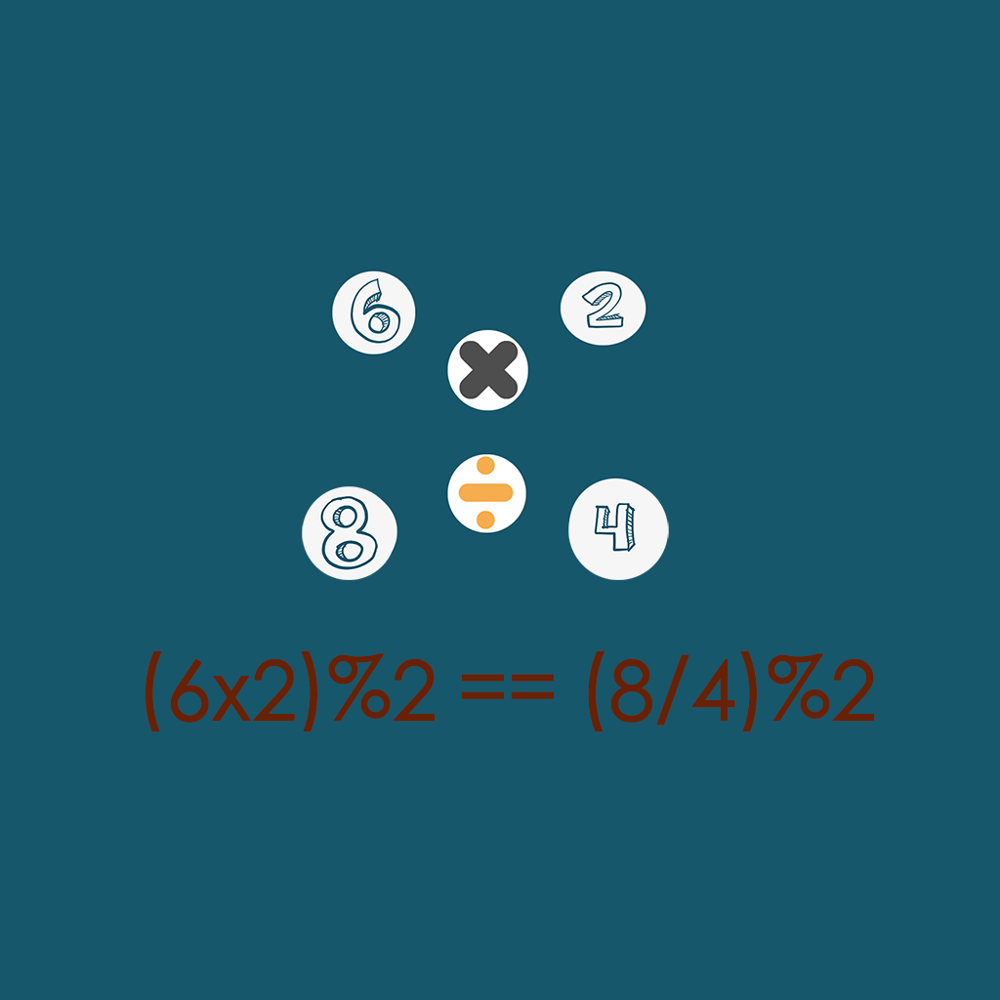

## Welcome to My Funny Even Number Pratice

This is an interesting exercise tool for even number calculation. Fill in the blanks to make the answers of two arithmetic equations equal. You can choose the numbers you want to practice and the types of arithmetic you want to practice. Each exercise will generate an arithmetic equation at random, which requires you to work out the answer. When you calculate the even answer, you need to fill in the blank according to the number you choose, so that you can write the arithmetic equation equal to the answer. If you get the right answer, you will be able to go to the next question and continue to answer, otherwise it will end and count your highest score.

If you have any questions, you can either leave a message or send the questions to our email address.

We will answer them for you in the first time.

### Address: zhanghesongyuan7@126.com

Thank you!
